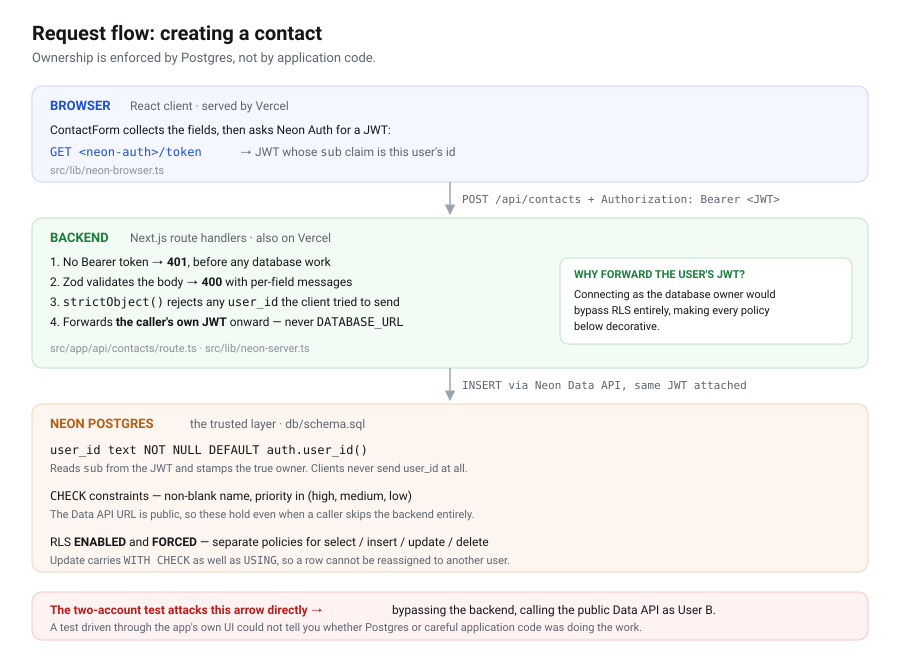

# Networking Tracker

A private contact tracker for the people you want to stay connected with at Berkeley. Each user
signs up, keeps their own list of contacts — name, company, role, where you met, notes, and a
high/medium/low priority — and can create, view, edit, delete, sort, filter, and search them.
Every row is owned by exactly one user and that ownership is enforced by Postgres Row Level
Security, not by application code, so one user cannot read or modify another user's contacts even
by calling the public Data API directly.

> **Live app:** **https://assign-1-secure-net-tracker.vercel.app**

---

## Contents

- [Features](#features)
- [Technology stack](#technology-stack)
- [Architecture](#architecture)
- [Database schema](#database-schema)
- [Authentication and RLS ownership](#authentication-and-rls-ownership)
- [Local setup](#local-setup)
- [Environment variables](#environment-variables)
- [Testing](#testing)
- [Deployment](#deployment)
- [Grading evidence](#grading-evidence)
- [Known limitations](#known-limitations)

---

## Features

- **Email + password auth** — sign up, sign in, sign out via Neon Managed Better Auth
- **Private contact list** — each user sees only their own contacts
- **Full CRUD** — create, view, edit, and delete contacts
- **Sort** — by name, company, priority, or date added, ascending or descending
- **Filter** — by priority (high / medium / low)
- **Search** — by name or company, debounced
- **Validation** — required name and constrained priority, enforced in both the API and the database
- **Understandable states** — distinct loading, empty, filtered-empty, success, and error UI
- **Responsive** — a table on desktop, stacked cards on mobile
- **Persistent** — data lives in Neon Postgres and survives refresh, logout, and redeploy

---

## Technology stack

| Layer | Choice | Why |
|---|---|---|
| Framework | **Next.js 16** (App Router) | One project holds a React frontend and a real HTTP backend (route handlers), so frontend and backend stay separate without running two deployments. |
| Language | **TypeScript** | The contact shape and the priority union are checked at compile time, so a typo like `priorty` fails the build rather than production. |
| Styling | **Tailwind CSS v4** | A design system in utility form. Responsive breakpoints make the same markup work at 375px and 1440px without bespoke CSS. |
| Database | **Neon Postgres** | Serverless Postgres with real RLS. RLS is the security requirement here, and Postgres enforces it in the engine rather than in app code. |
| Auth | **Neon Managed Better Auth** | Issues the JWT whose `sub` claim becomes `auth.user_id()` inside RLS policies. Auth and database share one identity, so there is no ID-mapping layer to get wrong. |
| Data access | **Neon Data API** (PostgREST) via `@neondatabase/neon-js` | Every request carries the user's JWT, so policies apply to each query automatically. |
| Validation | **Zod 4** | One schema shared by the route handlers and the test suite, so what is tested is what runs. |
| Tests | **Vitest** | Fast, no config, runs the validation suite in under a second. |
| Hosting | **Vercel** | First-party Next.js hosting with per-environment secrets. |

---

## Architecture



The same flow in text:

```
┌──────────────────────────────────────────────────────────────┐
│ Browser — React client components                            │
│   src/app/page.tsx            sign in / sign up              │
│   src/app/contacts/page.tsx   list, filter, sort, search     │
│   src/lib/neon-browser.ts     createClient({auth, dataApi})  │
└───────────────────────────┬──────────────────────────────────┘
                            │ fetch('/api/contacts')
                            │ Authorization: Bearer <user JWT>
                            ▼
┌──────────────────────────────────────────────────────────────┐
│ Backend — Next.js route handlers (run on the server)         │
│   src/app/api/contacts/route.ts       GET list, POST create  │
│   src/app/api/contacts/[id]/route.ts  PATCH, DELETE          │
│                                                              │
│   • Rejects requests with no Bearer token (401)              │
│   • Validates every body with Zod  → 400 + per-field errors  │
│   • Rejects unknown keys, so user_id can never be supplied   │
│   • Whitelists sort columns; strips PostgREST metacharacters │
│     from the search term                                     │
│   • Forwards the USER's JWT onward — never a database secret │
└───────────────────────────┬──────────────────────────────────┘
                            │ Neon Data API + that same JWT
                            ▼
┌──────────────────────────────────────────────────────────────┐
│ Neon Postgres — the trusted layer                            │
│   • CHECK constraints: non-blank name, priority in (h/m/l)   │
│   • user_id NOT NULL DEFAULT auth.user_id()                  │
│   • RLS policies for SELECT / INSERT / UPDATE / DELETE       │
└──────────────────────────────────────────────────────────────┘
```

### Why validation exists in two places

The Data API URL is public — it ships to the browser. Anyone holding it can `curl` the database
directly and skip the route handlers entirely. So the route handlers alone **cannot** be the
security boundary, no matter how careful their checks are.

The database constraints and RLS policies are therefore the *trusted* validation: they hold for
every caller, including one that never touches this app's code. The Zod layer exists on top of
them to return friendly, per-field error messages instead of raw Postgres constraint violations.
Neither layer is redundant — they answer different questions.

### Why the server never uses `DATABASE_URL`

A common shortcut is to have the backend connect as the database owner and filter by user in
application code. That would make every RLS policy in this project decorative: the owner
connection bypasses them, and one missing `WHERE user_id = ...` becomes a data breach.

Instead, route handlers construct a Data API client with `getToken` returning the **caller's own
JWT** (`src/lib/neon-server.ts`). Postgres evaluates `auth.user_id()` as that user, so the same
policies that protect direct API calls also protect requests routed through the server.
`DATABASE_URL` is used exactly once — by you, manually, to apply `db/schema.sql`.

---

## Database schema

Defined in [`db/schema.sql`](db/schema.sql).

| Column | Type | Constraints | Notes |
|---|---|---|---|
| `id` | `uuid` | PK, `default gen_random_uuid()` | |
| `user_id` | `text` | **NOT NULL**, `default auth.user_id()` | Owner. Never accepted from client input. |
| `name` | `text` | NOT NULL, `check (length(btrim(name)) > 0)` | Blank and whitespace-only rejected. |
| `company` | `text` | nullable | |
| `role` | `text` | nullable | |
| `where_met` | `text` | nullable | |
| `notes` | `text` | nullable | |
| `priority` | `text` | NOT NULL, `default 'medium'`, `check (priority in ('high','medium','low'))` | |
| `created_at` | `timestamptz` | NOT NULL, `default now()` | |
| `updated_at` | `timestamptz` | NOT NULL, `default now()` | Maintained by a `before update` trigger. |

Index: `contacts (user_id, created_at desc)` — the column pair every list query filters and orders on.

---

## Authentication and RLS ownership

**Sign-in flow.** Better Auth verifies the credentials and issues a session. The client calls
`neon.auth.getJWTToken()` to obtain a JWT whose `sub` claim is the user's ID, and sends it as a
Bearer token to the route handlers, which forward it to the Data API. Postgres exposes that claim
as `auth.user_id()`.

**The ownership rule.** Every policy compares `auth.user_id()` to the row's `user_id`:

```sql
alter table public.contacts enable row level security;
alter table public.contacts force  row level security;   -- applies to the owner too

create policy contacts_select_own on public.contacts
  for select to authenticated using (auth.user_id() = user_id);

create policy contacts_insert_own on public.contacts
  for insert to authenticated with check (auth.user_id() = user_id);

create policy contacts_update_own on public.contacts
  for update to authenticated
  using      (auth.user_id() = user_id)     -- rows you may target
  with check (auth.user_id() = user_id);    -- row must STILL be yours afterwards

create policy contacts_delete_own on public.contacts
  for delete to authenticated using (auth.user_id() = user_id);

grant select, insert, update, delete on public.contacts to authenticated;
```

Three details that do real work:

- **`WITH CHECK` on UPDATE.** `USING` alone would let a user edit their own row and rewrite
  `user_id` to someone else's, handing the row away (or, combined with a stolen ID, taking one).
  `WITH CHECK` re-tests the row *after* the edit, so a reassignment is rejected.
- **`FORCE ROW LEVEL SECURITY`.** Without it, the table owner silently bypasses every policy.
- **`DEFAULT auth.user_id()` on `user_id`.** Clients never send `user_id` at all; the database
  stamps the true owner. Combined with Zod's `strictObject`, a spoofed `user_id` is rejected at the
  API and could not take effect even if it were not.

Signed-out callers are granted nothing, so an unauthenticated request returns no rows.

---

## Local setup

**Prerequisites:** Node 20+ and a free [Neon](https://neon.tech) account.

```bash
git clone <your-repo-url>
cd assign-1-secure-net-tracker
npm install
```

**1. Create the Neon project.** In the Neon Console, create a project, then:

- **Auth** → enable **Neon Auth** with the email/password provider. Copy the **Auth URL**.
- **Data API** → enable it, tick **Grant public schema access**. Copy the **Data API URL**.

**2. Apply the schema.** Paste [`db/schema.sql`](db/schema.sql) into the Neon SQL Editor and run
it (or `psql "$DATABASE_URL" -f db/schema.sql`). It is idempotent, so re-running is safe.

**3. Configure environment.**

```bash
cp .env.example .env.local
# then edit .env.local with the two URLs from step 1
```

**4. Run.**

```bash
npm run dev     # http://localhost:3000
npm test        # validation suite
npm run lint    # eslint
npm run typecheck
```

---

## Environment variables

Names only — see [`.env.example`](.env.example) for the placeholder template. Real values belong
in `.env.local` (git-ignored) and in Vercel's dashboard.

| Variable | Scope | Read at runtime? | Purpose |
|---|---|---|---|
| `NEXT_PUBLIC_NEON_AUTH_URL` | Public | **Yes** | Neon Auth endpoint used by the browser client. |
| `NEXT_PUBLIC_NEON_DATA_API_URL` | Public | **Yes** | Data API endpoint for queries. |
| `DATABASE_URL` | **Server only** | No | Applying `db/schema.sql` once during setup. Never read by request-time code — see [Why the server never uses `DATABASE_URL`](#why-the-server-never-uses-database_url). |
| `NEON_AUTH_BASE_URL` | **Server only** | **Not used** | Would be the server-side copy of the Auth URL. Unused here: auth runs in the browser and the route handlers only forward the caller's JWT. |
| `NEON_AUTH_COOKIE_SECRET` | **Server only** | **Not used** | Would sign session cookies. Unused here: Neon Managed Better Auth owns the session; this app never mints one. |

Only the two public URLs are needed to run the app. The brief lists the other three
"if your implementation uses them" — this one uses `DATABASE_URL` for setup only, and does not
use the final two at all. They are kept in `.env.example`, commented out, so the decision is
visible rather than silent.

The two public URLs are endpoints, not credentials: holding them grants nothing, because RLS gates
every row. No secret is ever shipped to the browser, and `.gitignore` blocks `.env*` while
explicitly re-including `.env.example`.

---

## Testing

```bash
npm test
```

22 assertions in [`tests/validation.test.ts`](tests/validation.test.ts) covering
[`src/lib/validation.ts`](src/lib/validation.ts) — the module the route handlers actually import,
so the tests exercise production code rather than a copy:

| Group | Verifies |
|---|---|
| Required fields | Missing, empty, and **whitespace-only** names are rejected; valid names are trimmed |
| Priority | `high`/`medium`/`low` accepted; `urgent` and `HIGH` rejected; omitted defaults to `medium` |
| **Ownership** | A client-supplied `user_id` or `id` is **rejected** — mass-assignment cannot claim a row |
| Optional fields | Empty strings normalise to `NULL`; over-long values rejected |
| Updates | Single-field updates accepted; empty updates rejected; `priority` not silently defaulted |
| Query parsing | Unknown sort columns fall back to `created_at`; invalid priority filters ignored |

The whitespace-name and client-`user_id` cases are the two that matter most: the first is the bug
an untrimmed `min(1)` would let through, and the second is the API-layer half of the ownership
guarantee whose other half is the RLS `WITH CHECK`.

```
 Test Files  1 passed (1)
      Tests  22 passed (22)
```

### Live Row Level Security verification

```bash
npm run test:rls
```

A second suite, [`scripts/rls-test.mjs`](scripts/rls-test.mjs), runs against the **live database**.
It signs in as two real users and has User B attack User A's row through the public Data API,
bypassing the Next.js route handlers entirely. That distinction matters: a test driven through the
app's own UI could not tell you whether ownership is enforced by Postgres or merely by careful
application code. This one can.

```
=== Two-account Row Level Security verification ===
Attacks run against the public Data API, bypassing the app backend.

Authenticating both users...
Both users authenticated.

  [PASS]  A can create a contact
          id 77aceaf9...
  [PASS]  user_id stamped by the database, not the client
          user_id was populated by DEFAULT auth.user_id()
  [PASS]  B cannot READ A's contact
          B sees 0 row(s) in total
  [PASS]  B cannot UPDATE A's contact
          0 row(s) affected
  [PASS]  B cannot DELETE A's contact
          0 row(s) affected
  [PASS]  B cannot INSERT a row owned by A
          rejected by policy
  [PASS]  A's contact survived every attack
          name unchanged, row present

ALL CHECKS PASSED (7/7)
```

Each check maps to a specific policy in [`db/schema.sql`](db/schema.sql):

| Check | Enforced by |
|---|---|
| `user_id` stamped by the database | `DEFAULT auth.user_id()` on the column |
| B cannot READ A's contact | `contacts_select_own` |
| B cannot UPDATE A's contact | `contacts_update_own` (`USING`) |
| B cannot DELETE A's contact | `contacts_delete_own` |
| B cannot INSERT a row owned by A | `contacts_insert_own` (`WITH CHECK`) |

Credentials are read from a git-ignored `.rls-test.local`; the script prints instructions if it is
missing. No credentials are committed.

### Production smoke test

Run against the deployed app at https://assign-1-secure-net-tracker.vercel.app, exercising the
real Vercel route handlers rather than a local dev server:

```
  [PASS]  site loads publicly
          HTTP 200
  [PASS]  API rejects unauthenticated request
          HTTP 401
  [PASS]  sign-in works with production origin
          HTTP 200
  [PASS]  JWT minted
          HTTP 200
  [PASS]  production API returns contacts for signed-in user
          HTTP 200, 0 row(s)
  [PASS]  production validation rejects a blank name
          HTTP 400 {"name":"Name is required"}
```

The last two matter most: the deployed backend authenticates a real user and applies the same Zod
validation as local, so the security properties demonstrated above hold on the live site and not
only on a developer machine.

---

## Deployment

This project is deployed at
**https://assign-1-secure-net-tracker.vercel.app**.

1. Push to GitHub.
2. Deploy, either way:
   - **Vercel CLI** — `vercel link`, then `vercel deploy --prod`. No GitHub connection needed.
   - **Git integration** — import the repo at vercel.com for deploy-on-push. Requires a GitHub
     login connection on the Vercel account (`vercel git connect` once that exists).
3. Add the two public variables for Production:
   ```bash
   vercel env add NEXT_PUBLIC_NEON_AUTH_URL production --type config
   vercel env add NEXT_PUBLIC_NEON_DATA_API_URL production --type config
   ```
   `--type config` is required: Vercel asks you to confirm explicitly that a `NEXT_PUBLIC_`
   variable will be exposed to every visitor. Here that is intended — these are endpoints, not
   credentials, and RLS is what protects the rows.
4. **Add the deployed domain to Neon Auth's trusted origins** (Neon Console → Auth →
   Configuration). Without it the site loads but every sign-in fails with
   `403 INVALID_ORIGIN` — the app looks broken when the cause is one missing config entry.
   Verify with:
   ```bash
   curl -s -o /dev/null -w '%{http_code}\n' -X POST "$NEXT_PUBLIC_NEON_AUTH_URL/sign-in/email" \
     -H 'Content-Type: application/json' \
     -H 'Origin: https://your-app.vercel.app' \
     -d '{"email":"probe@example.invalid","password":"probe123"}'
   # 401 = origin trusted (bad credentials, as expected).  403 = origin NOT trusted.
   ```
5. Open the public URL in a private window and repeat the two-account privacy test against
   production.

Note: Vercel's per-deployment URLs (`...-hash-team.vercel.app`) sit behind Deployment Protection
and redirect to a login. The stable project alias above is the public one — that is the URL to
submit.

---

## Grading evidence

| Requirement | Evidence | Status |
|---|---|---|
| Automated test passes | `npm test` — 22/22, output in [Testing](#testing) | **Done** |
| **User A cannot access User B's contacts** | `npm run test:rls` — 7/7 against the live database, output in [Testing](#testing) | **Done** |
| Deployed app works end to end | Production smoke test — 6/6, output in [Testing](#testing) | **Done** |
| Schema and RLS ownership explained | [Authentication and RLS ownership](#authentication-and-rls-ownership) | **Done** |
| No committed secret values | `.env.example` holds placeholders only; `.env.local` and `.rls-test.local` are git-ignored and absent from history | **Done** |
| Sign-in and sign-out | `docs/screenshots/01-auth.png` | _to add_ |
| Create, edit, delete, refresh a contact | `docs/screenshots/02-crud.png` | _to add_ |
| Invalid input fails safely | `docs/screenshots/03-validation.png` | _to add_ |
| Two-account privacy, visually | `docs/screenshots/04-user-b-empty.png` | _to add_ |

### Screenshots

<!--
  Save each shot into docs/screenshots/ with the filename above, then replace
  the matching line here with:   
-->

**01-auth** — the sign-in form, and the signed-in header showing your email with the Sign out button.

**02-crud** — a contact in the list after creating it, ideally with the edit form open, and the same
list after a browser refresh to show persistence.

**03-validation** — the contact form with an empty name submitted, showing the inline
"Name is required" error. This error comes from the server, not the browser.

**04-user-b-empty** — the strongest visual: User A's list with contacts in it, beside User B's
"No contacts yet." Same app, same database, different accounts.

### Reproducing the privacy test yourself

```bash
# create .rls-test.local with two test accounts, then:
npm run test:rls
```

The script signs in as both users and has B attempt to read, update, delete, and forge A's row
**through the public Data API, bypassing this app's backend**. See [Testing](#testing) for output.

## Known limitations

- **Beta SDK, with a routing bug worked around.** `@neondatabase/neon-js` is `0.7.0-beta`, and its
  `getJWTToken()` requests `<authUrl>/api/auth/token` — better-auth's default base path. Neon's
  managed service serves that endpoint at `<authUrl>/token`, so the SDK call returns `404` and no
  authenticated request can be made. Probing every candidate path confirmed only `/token` exists.
  Both [`src/lib/neon-browser.ts`](src/lib/neon-browser.ts) and
  [`scripts/rls-test.mjs`](scripts/rls-test.mjs) call that endpoint directly, keeping the SDK helper
  as a fallback in case a later release fixes the path. Worth re-checking on the next version bump.
- **Error surfacing.** An early version of `AuthForm` assumed the SDK returned `{ error }`; it
  actually throws on non-2xx, so every real message ("email already exists", "password too short")
  was being replaced with a generic connection error. Errors are now read from both shapes, and a
  genuine network failure is distinguished by the absence of an HTTP status.
- **No pagination.** Every contact is fetched on each load. Fine for a personal list of tens;
  keyset pagination on `(user_id, created_at)` would be the fix past a few hundred.
- **No optimistic updates.** Mutations refetch the list, so there is a brief round-trip delay.
- **Search covers name and company only** — not notes or role.
- **No E2E tests.** The automated suite covers validation logic; auth flows and RLS are verified
  manually per the procedure above. Playwright against two seeded accounts would automate the
  privacy test, which is the highest-value thing to add next.
- **Delete uses `window.confirm`** rather than a styled dialog.
